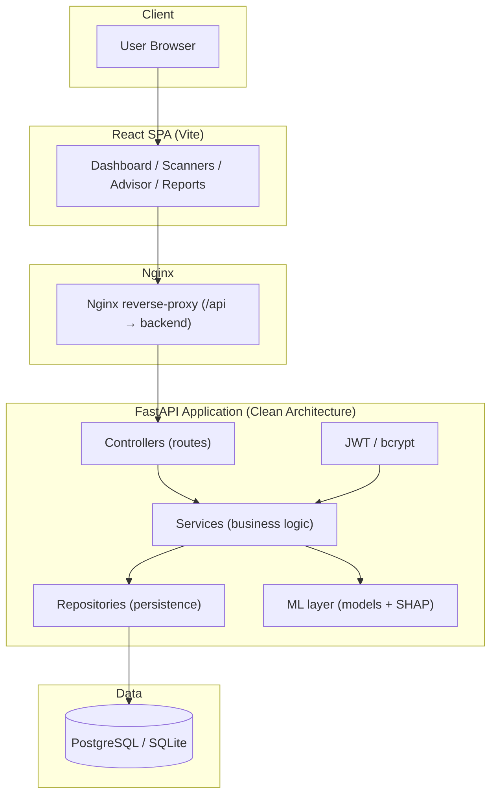
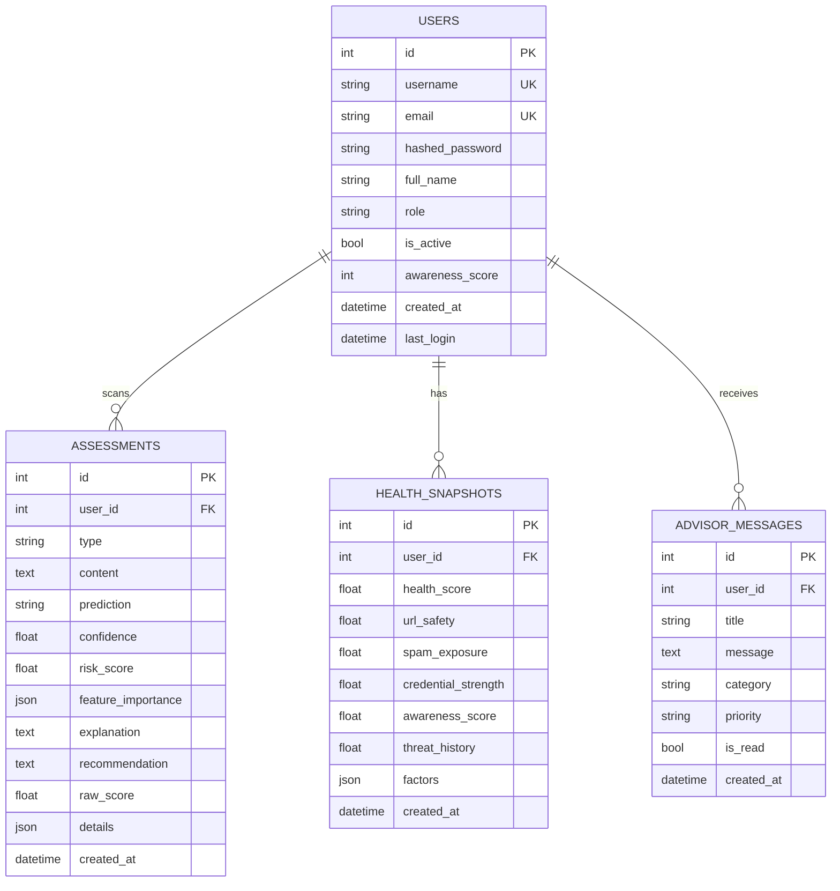
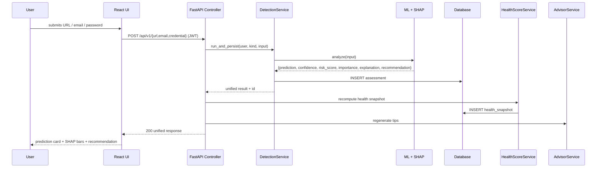
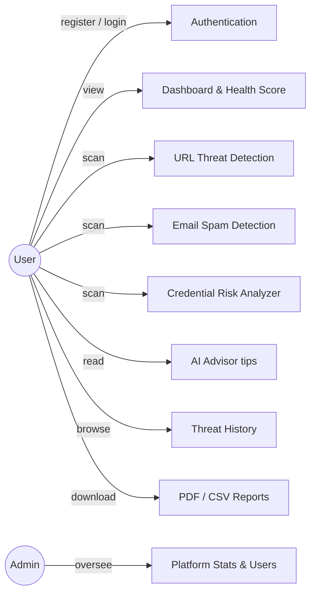
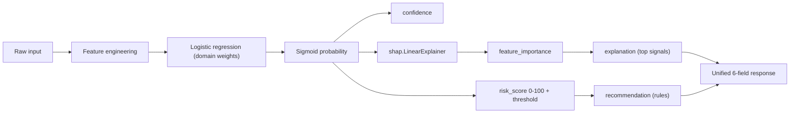

# RiskLens AI — Architecture & Design

> All diagrams are [Mermaid](https://mermaid.js.org) — they render natively on GitHub.

---

## 1. System Architecture



---

## 2. Database ER Diagram



---

## 3. Detection Sequence (scan → health → advice)



---

## 4. Use Case Diagram



---

## 5. Deployment Diagram

```mermaid
flowchart LR
    Internet((Internet))
    subgraph Docker Host
        N[Nginx :80]
        FE[Frontend Container (React build)]
        BE[Backend Container (uvicorn :8000)]
        DB[(PostgreSQL :5432)]
        N --> FE
        N -->|/api| BE
        BE --> DB
    end
    Internet --> N
```

---

## 6. Cyber Health Score Formula

```
HealthScore = 0.30·URL_Safety + 0.20·Spam_Exposure
            + 0.20·Credential_Strength + 0.15·Awareness
            + 0.15·Threat_History
```

Each component is derived per-user from stored assessments:

- **URL Safety** = 100 − avg(url risk_score)
- **Spam Exposure** = 100 − avg(email risk_score)
- **Credential Strength** = 100 − avg(credential risk_score)
- **Awareness** = user's quiz score (0–100)
- **Threat History** = 85 − (high-risk share × 65), floor 20

**Status bands:** ≥80 Excellent · ≥60 Good · ≥40 Fair · <40 At Risk

---

## 7. Detection Pipeline (every module)

